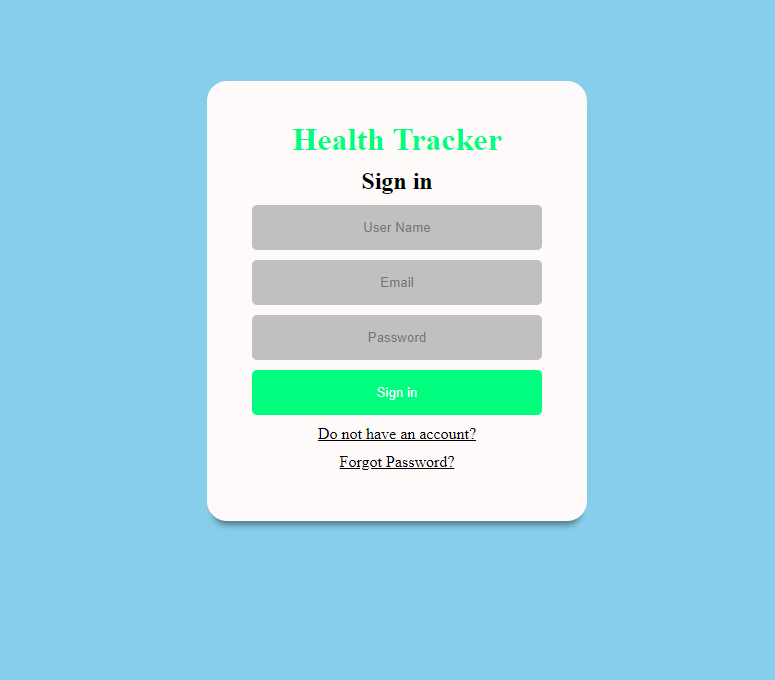
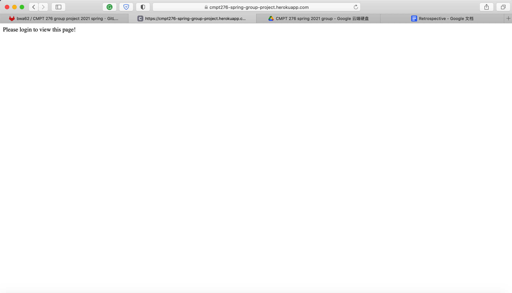

### Project abstract
Health Tracker is a web application which allows users to monitor and track their health. Users will sign up which includes creating a profile of where they are at currently. Features of this application will be that the users can set up their individual weekly workout plans and have pre-set calories for the day. The application will also have tracking of the calories they consume. This will help the user achieve their health goals while providing an insight to their fitness. Other possible features include having reminders if goals are met or asking if they have done the work.

### User stories for Iteration 1

#### As a user I want to log in

- invalid login

#### As a Guest I want to regester a user account

#### As a User I want to see my Dashboard

- dashboard when not sign in

